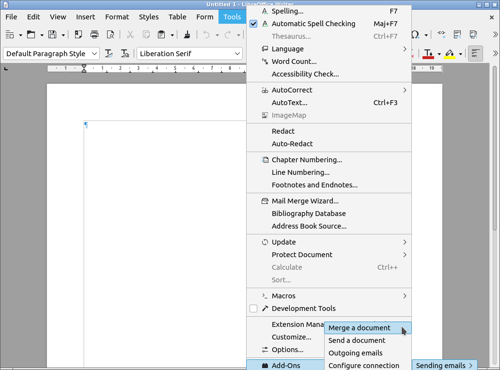
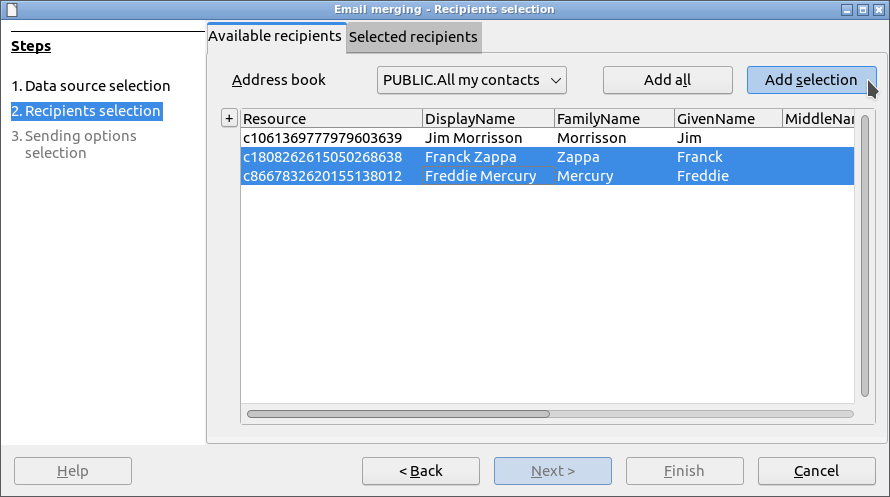
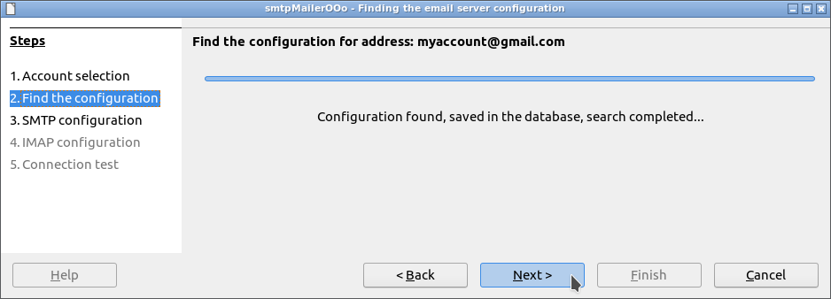
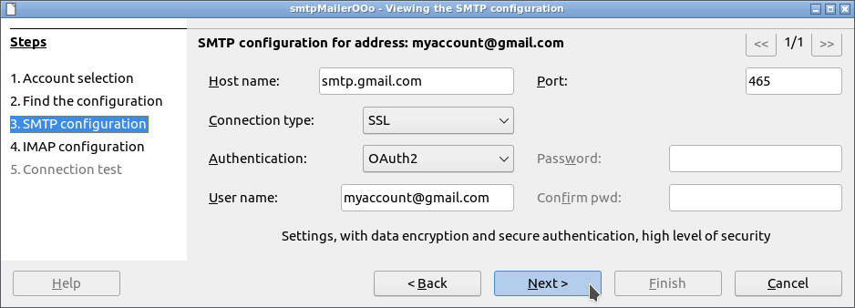
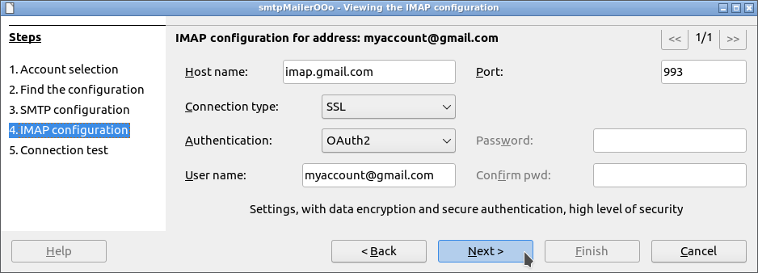
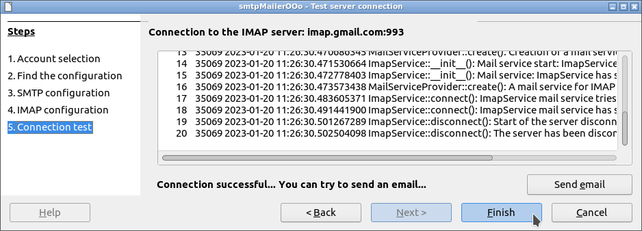

#  smtpMailerOOo

<!--
╔════════════════════════════════════════════════════════════════════════════════════╗
║                                                                                    ║
║   Copyright (c) 2020 https://prrvchr.github.io                                     ║
║                                                                                    ║
║   Permission is hereby granted, free of charge, to any person obtaining            ║
║   a copy of this software and associated documentation files (the "Software"),     ║
║   to deal in the Software without restriction, including without limitation        ║
║   the rights to use, copy, modify, merge, publish, distribute, sublicense,         ║
║   and/or sell copies of the Software, and to permit persons to whom the Software   ║
║   is furnished to do so, subject to the following conditions:                      ║
║                                                                                    ║
║   The above copyright notice and this permission notice shall be included in       ║
║   all copies or substantial portions of the Software.                              ║
║                                                                                    ║
║   THE SOFTWARE IS PROVIDED "AS IS", WITHOUT WARRANTY OF ANY KIND,                  ║
║   EXPRESS OR IMPLIED, INCLUDING BUT NOT LIMITED TO THE WARRANTIES                  ║
║   OF MERCHANTABILITY, FITNESS FOR A PARTICULAR PURPOSE AND NONINFRINGEMENT.        ║
║   IN NO EVENT SHALL THE AUTHORS OR COPYRIGHT HOLDERS BE LIABLE FOR ANY             ║
║   CLAIM, DAMAGES OR OTHER LIABILITY, WHETHER IN AN ACTION OF CONTRACT,             ║
║   TORT OR OTHERWISE, ARISING FROM, OUT OF OR IN CONNECTION WITH THE SOFTWARE       ║
║   OR THE USE OR OTHER DEALINGS IN THE SOFTWARE.                                    ║
║                                                                                    ║
╚════════════════════════════════════════════════════════════════════════════════════╝
-->

**Ce [document](https://prrvchr.github.io/smtpMailerOOo/README_fr) en français.**

**The use of this software subjects you to our** [**Terms Of Use**](https://prrvchr.github.io/smtpMailerOOo/smtpMailerOOo/registration/TermsOfUse_en) **and** [**Data Protection Policy**](https://prrvchr.github.io/smtpMailerOOo/smtpMailerOOo/registration/PrivacyPolicy_en)

# version [0.0.2](https://prrvchr.github.io/smtpMailerOOo#historical)

## Introduction:

**smtpMailerOOo** is part of a [Suite](https://prrvchr.github.io/) of [LibreOffice](https://fr.libreoffice.org/download/telecharger-libreoffice/) and/or [OpenOffice](https://www.openoffice.org/fr/Telecharger/) extensions allowing to offer you innovative services in these office suites.  
This extension allows you to send documents in LibreOffice / OpenOffice as an email, possibly by mail merge, to your telephone contacts.

Being free software I encourage you:
- To duplicate its [source code](https://github.com/prrvchr/smtpMailerOOo).
- To make changes, corrections, improvements.
- To open [issue](https://github.com/prrvchr/smtpMailerOOo/issues/new) if needed.

In short, to participate in the development of this extension.  
Because it is together that we can make Free Software smarter.

## Requirement:

smtpMailerOOo uses a local [HsqlDB](http://hsqldb.org/) database version 2.5.1.  
HsqlDB being a database written in Java, its use requires the [installation and configuration](https://wiki.documentfoundation.org/Documentation/HowTo/Install_the_correct_JRE_-_LibreOffice_on_Windows_10) in LibreOffice / OpenOffice of a **JRE version 11 or later**.  
I recommend [Adoptium](https://adoptium.net/releases.html?variant=openjdk11) as your Java installation source.

If you are using **LibreOffice on Linux**, then you are subject to [bug 139538](https://bugs.documentfoundation.org/show_bug.cgi?id=139538).  
To work around the problem, please uninstall the packages:
- libreoffice-sdbc-hsqldb
- libhsqldb1.8.0-java

If you still want to use the Embedded HsqlDB functionality provided by LibreOffice, then install the [HsqlDBembeddedOOo](https://prrvchr.github.io/HsqlDBembeddedOOo/) extension.  
OpenOffice and LibreOffice on Windows are not subject to this malfunction.

## Installation:

It seems important that the file was not renamed when it was downloaded.
If necessary, rename it before installing it.

- Install  **[OAuth2OOo.oxt](https://github.com/prrvchr/OAuth2OOo/raw/master/OAuth2OOo.oxt)** extension version 0.0.5.  
You must first install this extension, if it is not already installed.

- Install  **[HsqlDBDriverOOo.oxt](https://github.com/prrvchr/HsqlDBDriverOOo/raw/master/HsqlDBDriverOOo.oxt)** extension version 0.0.4.  
This extension is necessary to use HsqlDB version 2.5.1 with all its features.

- If you don't have a datasource, you can install one of the following extensions:

  -  **[vCardOOo.oxt](https://github.com/prrvchr/vCardOOo/raw/main/vCardOOo.oxt)** version 0.0.1.  
  This extension is only necessary if you want to use your contacts present on a [**Nextcloud**](https://en.wikipedia.org/wiki/Nextcloud) platform as a data source for mailing lists and document merging.

  -  **[gContactOOo.oxt](https://github.com/prrvchr/gContactOOo/raw/master/gContactOOo.oxt)** version 0.0.6.  
  This extension is only needed if you want to use your personal phone contacts (Android contact) as a data source for mailing lists and document merging.

- Install  **[smtpMailerOOo.oxt](https://github.com/prrvchr/smtpMailerOOo/raw/master/smtpMailerOOo.oxt)** extension version 0.0.2.  

Restart LibreOffice / OpenOffice after installation.

## Use:

### Introduction:

To be able to use the email merge feature using mailing lists, it is necessary to have a datasource with tables having the following columns:
- One or more columns of email addresses. These columns will be selected from a list and if this selection is not unique, then the first non-null email address will be used.
- A primary key column to uniquely identify records. This column must be of type SQL VARCHAR.
- A bookmark column, or row number column or `ROWNUM()`, which corresponds to the row number in the result set of an SQL command.

In addition, this datasource must have at least one **main table**, including all the records that can be used during the email merge.

If you do not have such a data source then I invite you to install one of the following extensions:
- [vCardOOo](https://github.com/prrvchr/vCardOOo/raw/main/vCardOOo.oxt) extension.  
This extension will allow you to use your contacts present on a [**Nextcloud**](https://en.wikipedia.org/wiki/Nextcloud) platform as a data source.
- [gContactOOo](https://github.com/prrvchr/gContactOOo/raw/master/gContactOOo.oxt) extension.  
This extension will allow you to use your Android phone (your phone contacts) as a datasource.

This mode of use is made up of 3 sections:
- [Merging emails to mailing lists](https://prrvchr.github.io/smtpMailerOOo/#merging-emails-to-mailing-lists).
- [Configure connection](https://prrvchr.github.io/smtpMailerOOo/#configure-connection).
- [Outgoing emails](https://prrvchr.github.io/smtpMailerOOo/#outgoing-emails).

### Merging emails to mailing lists:

#### Requirement:

To be able to post emails to a mailing list, you must:
- Have a data source as described in the previous introduction.
- Open a Writer document in LibreOffice / OpenOffice.

This Writer document can include merge fields (insertable by the command: **Insert -> Field -> More fields -> Database -> Mail merge fields**), this is even necessary if you want to be able to customize the content of the email.  
These merge fields should only reference the **main table** of the data source.

#### Starting the mail merge wizard:

In LibreOffice / OpenOffice Writer document go to: **Tools -> Add-Ons -> Sending emails -> Merge a document**

#### Data source selection:

The datasource load for the **Email merging** wizard should appear: 

The following screenshots use the [gContactOOo](https://github.com/prrvchr/gContactOOo/raw/master/gContactOOo.oxt) extension as the data source. If you are using your own data source, it is necessary to adapt the settings in relation to it.

In the following screenshot, we can see that the data source gContactOOo is called: `Addresses` and that the **main table**: `My Google contacts` is selected.

If no mailing list exists, you need to create one, by entering its name and validating with: `ENTER` or the `Add` button.

Make sure when creating the mailing list that the **main table** is always selected.

Now that your new mailing list is available in the list, you need to select it.

And add the following columns:
- Primary key column: `Resource`
- Bookmark column: `Bookmark`
- Email address columns: `HomeEmail`, `WorkEmail` and `OtherEmail`

If several columns of email addresses are selected, then the order becomes relevant since the email will be sent to the first available address.  
In addition, on Recipients selection step of the wizard, in the [Available recipients](https://prrvchr.github.io/smtpMailerOOo/#available-recipients) tab, only records with at least one email address column entered will be listed.  
So make sure you have an address book with at least one of the email address columns entered.

This setting is to be made only for new mailing lists.  
You can now proceed to the next step.

#### Recipients selection:

##### Available recipients:

The recipients are selected using 2 buttons `Add all` and `Add` allowing respectively:
- To add all recipients.
- Add the selection, which can be multiple using the `CTRL` key.

Example of multiple selection:

##### Selected recipients:

The recipients are deselected using 2 buttons `Remove all` and `Remove` allowing respectively:
- To remove all recipients.
- Remove the selection, which can be multiple using the `CTRL` key. 

If you have selected at least 1 recipient, you can proceed to the next step.

#### Sending options selection:

If this is not already done, you must create a new sender using the `Add` button.

The creation of the new sender is described in the [Configure connection](https://prrvchr.github.io/smtpMailerOOo/#configure-connection) section.

The email must have a subject. It can be saved in the Writer document.

The email may optionally have attached files. They can be saved in the Writer document.  
The following screenshot shows 1 attached file which will be merged on the data source then converted to PDF format before being attached to the email.

Make sure to always exit the wizard with the `Finish` button to confirm submitting the send jobs.  
To submit mailing jobs, please follow the section [Outgoing emails](https://prrvchr.github.io/smtpMailerOOo/#outgoing-emails).

### Configure connection:

#### Limitation:

Although the smtpMailerOOo extension is designed to use the Google SMTP servers (smtp.gmail.com) using the OAuth2 protocol, **it is not yet possible to connect to these SMTP servers**, the OAuth2OOo extension being not yet approved by Google.  
Thank you for your understanding and your patience.

In the meantime, if you still want to use your Google account as sender, proceed as follows:
- Create a connection configuration with your account of your internet access provider (for example: myaccount@att.net). Note the connection settings used.
- Create a connection configuration with your Google account and enter the connection settings of your access provider, noted precedently.

#### Starting the connection wizard:

In LibreOffice / OpenOffice go to: **Tools -> Add-Ons -> Sending emails -> Configure connection**

#### Account selection:

#### Find the configuration:

#### Show configuration:

#### Connection test:

Always exit the wizard with the `Finish` button to save the connection settings.

### Outgoing emails:

#### Starting the email spooler:

In LibreOffice / OpenOffice go to: **Tools -> Add-Ons -> Sending emails -> Outgoing emails**

#### List of outgoing emails:

Each send job has 3 different states:
- State **0**: the email is ready for sending.
- State **1**: the email was sent successfully.
- State **2**: An error occurred while sending the email. You can view the error message in the [Spooler activity log](https://prrvchr.github.io/smtpMailerOOo/#spooler-activity-log). 

The email spooler is stopped by default. **It must be started with the `Start / Stop` button so that the pending emails are sent**.

#### Spooler activity log:

When the email spooler is started, its activity can be viewed in the activity log.

## Historical:

### What has been done for version 0.0.1:

- Writing an [IspDB](https://github.com/prrvchr/smtpMailerOOo/tree/master/smtpMailerOOo/pythonpath/smtpmailer/ispdb) or SMTP servers connection configuration wizard allowing:
    - Find the connection parameters to an SMTP server from an email address. Besides, I especially thank Mozilla, for [Thunderbird autoconfiguration database](https://wiki.mozilla.org/Thunderbird/ISPDB) or IspDB, which made this challenge possible...
    - Display the activity of the UNO service `com.sun.star.mail.MailServiceProvider` when connecting to the SMTP server and sending an email.

- Writing an email [Spooler](https://github.com/prrvchr/smtpMailerOOo/tree/master/smtpMailerOOo/pythonpath/smtpmailer/spooler) allowing:
    - View the email sending jobs with their respective status.
    - Display the activity of the UNO service `com.sun.star.mail.SpoolerService` when sending emails.
    - Start and stop the spooler service.

- Writing an email [Merger](https://github.com/prrvchr/smtpMailerOOo/tree/master/smtpMailerOOo/pythonpath/smtpmailer/merger) allowing:
    - To create mailing lists.
    - To merge and convert the current document to HTML format to make it the email message.
    - To merge and/or convert in PDF format any possible files attached to the email. 

- Writing a document [Mailer](https://github.com/prrvchr/smtpMailerOOo/tree/master/smtpMailerOOo/pythonpath/smtpmailer/mailer) allowing:
    - To convert the document to HTML format to make it the email message.
    - To convert in PDF format any possible files attached to the email.

- Writing a [Grid](https://github.com/prrvchr/smtpMailerOOo/tree/master/uno/lib/uno/grid) driven by a `com.sun.star.sdb.RowSet` allowing:
    - To be configurable on the columns to be displayed.
    - To be configurable on the sort order to be displayed.
    - Save the display settings.

- Many other things...

### What has been done for version 0.0.2:

- Rewrite of [IspDB](https://github.com/prrvchr/smtpMailerOOo/tree/master/smtpMailerOOo/pythonpath/smtpmailer/ispdb) or Mail servers connection configuration wizard in order to integrate the IMAP connection configuration.
  - Use of [IMAPClient](https://github.com/mjs/imapclient#readme) version 2.2.0: an easy-to-use, Pythonic and complete IMAP client library.
  - Extension of [com.sun.star.mail.*](https://github.com/prrvchr/smtpMailerOOo/tree/master/rdb/idl/com/sun/star/mail) IDL files:
    - [XMailMessage2.idl](https://github.com/prrvchr/smtpMailerOOo/blob/master/rdb/idl/com/sun/star/mail/XMailMessage2.idl) now supports email threading.
    - The new [XImapService.idl](https://github.com/prrvchr/smtpMailerOOo/blob/master/rdb/idl/com/sun/star/mail/XImapService.idl) interface allows access to part of the IMAPClient library.

- Rewriting of the [Spooler](https://github.com/prrvchr/smtpMailerOOo/tree/master/smtpMailerOOo/pythonpath/smtpmailer/mailspooler.py) in order to integrate IMAP functionality such as the creation of a thread summarizing the mailing and grouping all the emails sent.

### What remains to be done for version 0.0.2:

- **Resubmit the smtpMailerOOo extension to Google in order to obtain permission to use their SMTP and IMAP servers with OAuth2OOo.**
