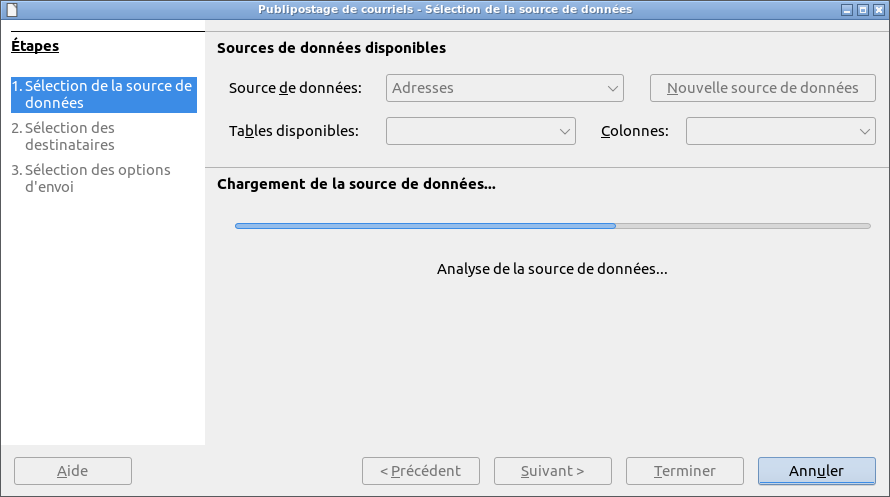
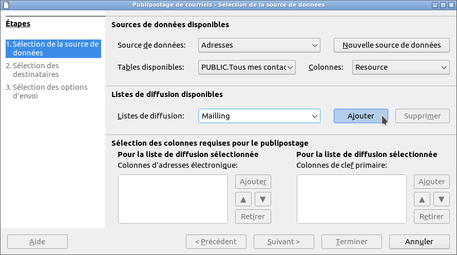
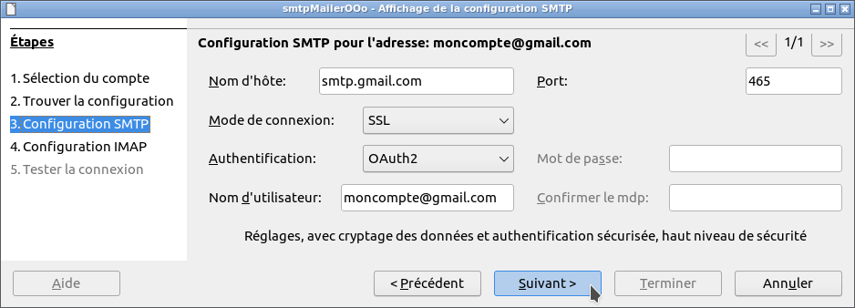
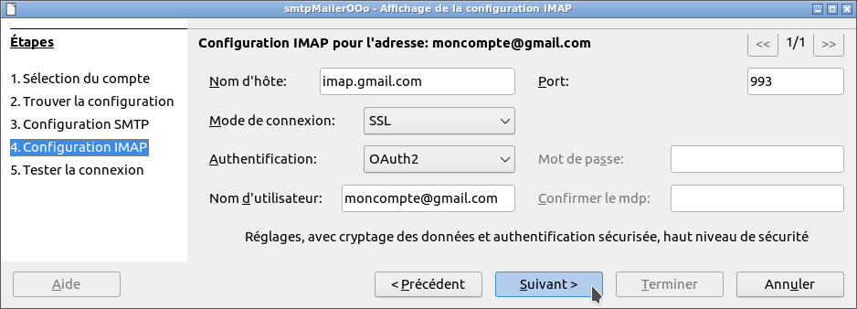
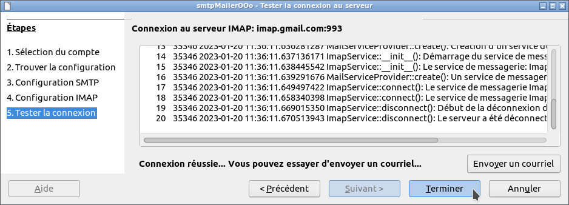

#  smtpMailerOOo

<!--
╔════════════════════════════════════════════════════════════════════════════════════╗
║                                                                                    ║
║   Copyright (c) 2020 https://prrvchr.github.io                                     ║
║                                                                                    ║
║   Permission is hereby granted, free of charge, to any person obtaining            ║
║   a copy of this software and associated documentation files (the "Software"),     ║
║   to deal in the Software without restriction, including without limitation        ║
║   the rights to use, copy, modify, merge, publish, distribute, sublicense,         ║
║   and/or sell copies of the Software, and to permit persons to whom the Software   ║
║   is furnished to do so, subject to the following conditions:                      ║
║                                                                                    ║
║   The above copyright notice and this permission notice shall be included in       ║
║   all copies or substantial portions of the Software.                              ║
║                                                                                    ║
║   THE SOFTWARE IS PROVIDED "AS IS", WITHOUT WARRANTY OF ANY KIND,                  ║
║   EXPRESS OR IMPLIED, INCLUDING BUT NOT LIMITED TO THE WARRANTIES                  ║
║   OF MERCHANTABILITY, FITNESS FOR A PARTICULAR PURPOSE AND NONINFRINGEMENT.        ║
║   IN NO EVENT SHALL THE AUTHORS OR COPYRIGHT HOLDERS BE LIABLE FOR ANY             ║
║   CLAIM, DAMAGES OR OTHER LIABILITY, WHETHER IN AN ACTION OF CONTRACT,             ║
║   TORT OR OTHERWISE, ARISING FROM, OUT OF OR IN CONNECTION WITH THE SOFTWARE       ║
║   OR THE USE OR OTHER DEALINGS IN THE SOFTWARE.                                    ║
║                                                                                    ║
╚════════════════════════════════════════════════════════════════════════════════════╝
-->

**This [document](https://prrvchr.github.io/smtpMailerOOo) in English.**

**L'utilisation de ce logiciel vous soumet à nos** [**Conditions d'utilisation**](https://prrvchr.github.io/smtpMailerOOo/smtpMailerOOo/registration/TermsOfUse_fr) **et à notre** [**Politique de protection des données**](https://prrvchr.github.io/smtpMailerOOo/smtpMailerOOo/registration/PrivacyPolicy_fr)

# version [0.0.2](https://prrvchr.github.io/smtpMailerOOo/README_fr#historique)

## Introduction:

**smtpMailerOOo** fait partie d'une [Suite](https://prrvchr.github.io/README_fr) d'extensions [LibreOffice](https://fr.libreoffice.org/download/telecharger-libreoffice/) et/ou [OpenOffice](https://www.openoffice.org/fr/Telecharger/) permettant de vous offrir des services inovants dans ces suites bureautique.  
Cette extension vous permet d'envoyer des documents dans LibreOffice / OpenOffice sous forme de courriel, éventuellement par publipostage, à vos contacts téléphoniques.

Etant un logiciel libre je vous encourage:
- A dupliquer son [code source](https://github.com/prrvchr/smtpMailerOOo).
- A apporter des modifications, des corrections, des améliorations.
- D'ouvrir un [dysfonctionnement](https://github.com/prrvchr/smtpMailerOOo/issues/new) si nécessaire.

Bref, à participer au developpement de cette extension.  
Car c'est ensemble que nous pouvons rendre le Logiciel Libre plus intelligent.

## Prérequis:

smtpMailerOOo utilise une base de données locale [HsqlDB](http://hsqldb.org/) version 2.5.1.  
HsqlDB étant une base de données écrite en Java, son utilisation nécessite [l'installation et la configuration](https://wiki.documentfoundation.org/Documentation/HowTo/Install_the_correct_JRE_-_LibreOffice_on_Windows_10/fr) dans LibreOffice / OpenOffice d'un **JRE version 11 ou ultérieure**.  
Je vous recommande [Adoptium](https://adoptium.net/releases.html?variant=openjdk11) comme source d'installation de Java.

Si vous utilisez **LibreOffice sous Linux**, alors vous êtes sujet au [dysfonctionnement 139538](https://bugs.documentfoundation.org/show_bug.cgi?id=139538).  
Pour contourner le problème, veuillez désinstaller les paquets:
- libreoffice-sdbc-hsqldb
- libhsqldb1.8.0-java

Si vous souhaitez quand même utiliser la fonctionnalité HsqlDB intégré fournie par LibreOffice, alors installez l'extension [HsqlDBembeddedOOo](https://prrvchr.github.io/HsqlDBembeddedOOo/README_fr).  
OpenOffice et LibreOffice sous Windows ne sont pas soumis à ce dysfonctionnement.

## Installation:

Il semble important que le fichier n'ait pas été renommé lors de son téléchargement.  
Si nécessaire, renommez-le avant de l'installer.

- Installer l'extension  **[OAuth2OOo.oxt](https://github.com/prrvchr/OAuth2OOo/raw/master/OAuth2OOo.oxt)** version 0.0.5.  
Vous devez d'abord installer cette extension, si elle n'est pas déjà installée.

- Installer l'extension  **[HsqlDBDriverOOo.oxt](https://github.com/prrvchr/HsqlDBDriverOOo/raw/master/HsqlDBDriverOOo.oxt)** version 0.0.4.  
Cette extension est nécessaire pour utiliser HsqlDB version 2.5.1 avec toutes ses fonctionnalités.

- Si vous n'avez pas de source de données, vous pouvez installer l'une des extensions suivantes:

  -  **[vCardOOo.oxt](https://github.com/prrvchr/vCardOOo/raw/main/vCardOOo.oxt)** version 0.0.1.  
  Cette extension n'est nécessaire que si vous souhaitez utiliser vos contacts présents sur une plateforme [**Nextcloud**](https://fr.wikipedia.org/wiki/Nextcloud) comme source de données pour les listes de diffusion et la fusion de documents.

  -  **[gContactOOo.oxt](https://github.com/prrvchr/gContactOOo/raw/master/gContactOOo.oxt)** version 0.0.6.  
  Cette extension n'est nécessaire que si vous souhaitez utiliser vos contacts téléphoniques personnels (contact Android) comme source de données pour les listes de diffusion et la fusion de documents.

- Installer l'extension  **[smtpMailerOOo.oxt](https://github.com/prrvchr/smtpMailerOOo/releases/download/v0.0.1/smtpMailerOOo.oxt)** version 0.0.1.  
Redémarrez LibreOffice / OpenOffice après l'installation.

## Utilisation:

### Introduction:

Pour pouvoir utiliser la fonctionnalité de publipostage de courriels en utilisant des listes de diffusion, il est nécessaire d'avoir une source de données avec des tables ayant les colonnes suivantes:
- Une ou plusieurs colonnes d'adresses électroniques. Ces colonnes seront sélectionnées dans une liste et si cette sélection n'est pas unique, alors la première adresse courriel non nulle sera utilisée.
- Une colonne de clé primaire permettant d'identifier de manière unique les enregistrements. Cette colonne doit être de type SQL VARCHAR.
- Une colonne bookmark, ou numéro de ligne ou `ROWNUM()`, qui correspond au numéro de ligne dans le jeu de résultats d'une commande SQL.

De plus, cette source de données doit avoir au moins une **table principale**, comprenant tous les enregistrements pouvant être utilisés lors du publipostage du courriel.

Si vous ne disposez pas d'une telle source de données alors je vous invite à installer une des extensions suivantes :
- [vCardOOo](https://github.com/prrvchr/vCardOOo/raw/main/vCardOOo.oxt) extension.  
Cette extension vous permettra d'utiliser vos contacts présents sur une plateforme [**Nextcloud**](https://fr.wikipedia.org/wiki/Nextcloud) comme source de données.
- [gContactOOo](https://github.com/prrvchr/gContactOOo/raw/master/gContactOOo.oxt).  
Cette extension vous permettra d'utiliser votre téléphone Android (vos contacts téléphoniques) comme source de données.

Ce mode d'utilisation est composé de 3 sections:
- [Publipostage de courriels à des listes de diffusion](https://prrvchr.github.io/smtpMailerOOo/README_fr#publipostage-de-courriels-à-des-listes-de-diffusion).
- [Configuration de la connexion](https://prrvchr.github.io/smtpMailerOOo/README_fr#configuration-de-la-connexion).
- [Courriels sortants](https://prrvchr.github.io/smtpMailerOOo/README_fr#courriels-sortants).

### Publipostage de courriels à des listes de diffusion:

#### Prérequis:

Pour pouvoir publiposter des courriels suivant une liste de diffusion, vous devez:
- Disposer d'une source de données comme décrit dans l'introduction précédente.
- Ouvrir un document Writer dans LibreOffice / OpenOffice.

Ce document Writer peut inclure des champs de fusion (insérables par la commande: **Insertion -> Champ -> Autres champs -> Base de données -> Champ de publipostage**), cela est même nécessaire si vous souhaitez pouvoir personnaliser le contenu du courriel.  
Ces champs de fusion doivent uniquement faire référence à la **table principale** de la source de données.

#### Démarrage de l'assistant de publipostage de courriels:

Dans un document LibreOffice / OpenOffice Writer aller à: **Outils -> Add-ons -> Envoi de courriels -> Publiposter un document**

#### Sélection de la source de données:

Le chargement de la source de données de l'assistant **Publipostage de courriels** devrait apparaître :

Les captures d'écran suivantes utilisent l'extension [gContactOOo](https://github.com/prrvchr/gContactOOo/raw/master/gContactOOo.oxt) comme source de données. Si vous utilisez votre propre source de données, il est nécessaire d'adapter les paramètres par rapport à celle-ci. 

Dans la copie d'écran suivante, on peut voir que la source de données gContactOOo s'appelle: `Adresses` et que la **table principale**: `Mes contacts Google` est sélectionnée.

Si aucune liste de diffusion n'existe, vous devez en créer une, en saisissant son nom et en validant avec: `ENTRÉE` ou le bouton `Ajouter`.

Assurez-vous lors de la création de liste de diffusion que la **table principale** est toujours bien sélectionnée.

Maintenant que votre nouvelle liste de diffusion est disponible dans la liste, vous devez la sélectionner.

Et ajouter les colonnes suivantes:
- Colonne de clef primaire: `Resource`
- Colonne bookmark: `Bookmark`
- Colonnes d'adresses électronique: `HomeEmail`, `WorkEmail` et `OtherEmail`

Si plusieurs colonnes d'adresses courriel sont sélectionnées, alors l'ordre devient pertinent puisque le courriel sera envoyé à la première adresse disponible.  
De plus, à l'étape Sélection des destinataires de l'assistant, dans l'onglet [Destinataires disponibles](https://prrvchr.github.io/smtpMailerOOo/README_fr#destinataires-disponibles), seuls les enregistrements avec au moins une colonne d'adresse courriel saisie seront répertoriés.  
Assurez-vous donc d'avoir un carnet d'adresses avec au moins une des colonnes d’adresses courriel renseignées.

Ce paramètrage ne doit être effectué que pour les nouvelles listes de diffusion.  
Vous pouvez maintenant passer à l'étape suivante.

#### Sélection des destinataires:

##### Destinataires disponibles:

Les destinataires sont sélectionnés à l'aide de 2 boutons `Tout ajouter` et `Ajouter` permettant respectivement:
- D'ajouter tous les destinataires.
- D'ajouter la sélection, qui peut être multiple à l'aide de la touche `CTRL`.

Example de la sélection multiple:

##### Destinataires sélectionnés:

Les destinataires sont désélectionnés à l'aide de 2 boutons `Tout retirer` et `Retirer` permettant respectivement:
- De retirer tous les destinataires.
- De retirer la sélection, qui peut être multiple à l'aide de la touche `CTRL`.

Si vous avez sélectionné au moins 1 destinataire, vous pouvez passer à l'étape suivante.

#### Sélection des options d'envoi:

Si cela n'est pas déjà fait, vous devez créer un nouvel expéditeur à l'aide du bouton `Ajouter`.

La création du nouvel expéditeur est décrite dans la section [Configuration de la connexion](https://prrvchr.github.io/smtpMailerOOo/README_fr#configuration-de-la-connexion).

Le courriel doit avoir un sujet. Il peut être enregistré dans le document Writer.

Le courriel peut éventuellement contenir des fichiers joints. Ils peuvent être enregistrés dans le document Writer.  
La capture d'écran suivante montre 1 fichier joint qui sera fusionné sur la source de données puis converti au format PDF avant d'être joint au courriel.

Assurez-vous de toujours quitter l'assistant avec le bouton `Terminer` pour confirmer la soumission des travaux d'envoi.  
Pour envoyer les travaux d'envoi, veuillez suivre la section [Courriels sortants](https://prrvchr.github.io/smtpMailerOOo/README_fr#courriels-sortants).

### Configuration de la connexion:

#### Limitations:

Bien que l'extension smtpMailerOOO est conçue pour utiliser les serveurs SMTP de Google (smtp.gmail.com) à l'aide du protocole OAuth2, **il n'est pas encore possible de se connecter à ces serveurs SMTP**, l'extension OAuth2OOo n'étant pas encore approuvé par Google.  
Merci de votre compréhension et de votre patience.

En attendant, si vous souhaitez quand même utiliser votre compte Google comme expéditeur, procédez comme suit:
- Créez une Configuration de connexion avec votre compte de votre fourniseur d'acces internet (par exemple: moncompte@orange.fr). Notez les paramètres de connexion utilisés.
- Créez une Configuration de connexion avec votre compte Google et saisir les paramètres de connexion de votre fournisseur d'accès, notés précédemment.

#### Démarrage de l'assistant de connexion:

Dans LibreOffice / OpenOffice aller à: **Outils -> Add-ons -> Envoi de courriels -> Configurer la connexion**

#### Sélection du compte:

#### Trouver la configuration:

#### Afficher la configuration:

#### Tester la connexion:

Assurez-vous de toujours quitter l'assistant avec le bouton `Terminer` afin d'enregistrer les paramètres de connexion.

### Courriels sortants:

#### Démarrage du spouleur de courriels:

Dans LibreOffice / OpenOffice aller à: **Outils -> Add-ons -> Envoi de courriels -> Courriels sortants**

#### Liste des courriels sortants:

Chaque travaux d'envoi possède 3 états différents:
- État **0**: le courriel est prêt à être envoyé.
- État **1**: le courriel a été envoyé avec succès.
- État **2**: Une erreur est survenue lors de l'envoi du courriel. Vous pouvez consulter le message d'erreur dans le [Journal d'activité du spouleur](https://prrvchr.github.io/smtpMailerOOo/README_fr#journal-dactivité-du-spouleur).

Le spouleur de courriels est arrêté par défaut. **Il doit être démarré avec le bouton `Démarrer / Arrêter` pour que les courriels en attente soient envoyés**.

#### Journal d'activité du spouleur:

Lorsque le spouleur de courriel est démarré, son activité peut être visualisée dans le journal d'activité.

## Historique:

### Ce qui a été fait pour la version 0.0.1:

- Ecriture de [IspDB](https://github.com/prrvchr/smtpMailerOOo/tree/master/smtpMailerOOo/pythonpath/smtpmailer/ispdb) ou l'assistant de Configuration de connexion aux serveurs SMTP permettant:
    - De trouver les paramètres de connexion à un serveur SMTP à partir d'une adresse courriel. D'ailleur je remercie particulierement Mozilla, pour [Thunderbird autoconfiguration database](https://wiki.mozilla.org/Thunderbird/ISPDB) ou IspDB, qui à rendu ce défi possible...
    - D'afficher l'activité du service UNO `com.sun.star.mail.MailServiceProvider` lors de la connexion au serveur SMTP et l'envoi d'un courriel. 

- Ecriture du [Spouleur](https://github.com/prrvchr/smtpMailerOOo/tree/master/smtpMailerOOo/pythonpath/smtpmailer/spooler) de courriels permettant:
    - D'afficher les travaux d'envoi de courriel avec leurs états respectifs.
    - D'afficher l'activité du service UNO `com.sun.star.mail.SpoolerService` lors de l'envoi de courriels.
    - De démarrer et arrêter le service spouleur.

- Ecriture du [Merger](https://github.com/prrvchr/smtpMailerOOo/tree/master/smtpMailerOOo/pythonpath/smtpmailer/merger) ou l'assistant de publipostage de courriels permettant:
    - De créer des listes de diffusions.
    - De fusionner et convertir au format HTML le document courant pour en faire le message du courriel.
    - De fusionner et/ou convertir au format PDF d'éventuel fichiers joints au courriel.

- Ecriture du [Mailer](https://github.com/prrvchr/smtpMailerOOo/tree/master/smtpMailerOOo/pythonpath/smtpmailer/mailer) de document permettant:
    - De convertir au format HTML le document pour en faire le message du courriel.
    - De convertir au format PDF d'éventuel fichiers joints au courriel.

- Ecriture d'un [Grid](https://github.com/prrvchr/smtpMailerOOo/tree/master/uno/lib/uno/grid) piloté par un `com.sun.star.sdb.RowSet` permettant:
    - D'être paramètrable sur les colonnes à afficher.
    - D'être paramètrable sur l'ordre de tri à afficher.
    - De sauvegarder les paramètres d'affichage.

- Encore plein d'autres choses...

### Ce qui a été fait pour la version 0.0.2:

**Tant que la version 0.0.2 n'est pas disponible, nous vous conseillons d'utiliser la version [0.0.1](https://github.com/prrvchr/smtpMailerOOo/releases/download/v0.0.1/smtpMailerOOo.oxt) malgré ses limitations...**

- Réécriture de [IspDB](https://github.com/prrvchr/smtpMailerOOo/tree/master/smtpMailerOOo/pythonpath/smtpmailer/ispdb) ou Assistant de configuration de connexion aux serveurs de messagerie afin d'intégrer la configuration de la connexion IMAP.
  - Utilisation de [IMAPClient](https://github.com/mjs/imapclient#readme) version 2.2.0: une bibliothèque cliente IMAP complète, Pythonic et facile à utiliser.
  - Extension des fichiers IDL [com.sun.star.mail.*](https://github.com/prrvchr/smtpMailerOOo/tree/master/rdb/idl/com/sun/star/mail):
    - [XMailMessage2.idl](https://github.com/prrvchr/smtpMailerOOo/blob/master/rdb/idl/com/sun/star/mail/XMailMessage2.idl) prend désormais en charge la hiérarchisation des courriels (thread).
    - La nouvelle interface [XImapService](https://github.com/prrvchr/smtpMailerOOo/blob/master/rdb/idl/com/sun/star/mail/XImapService.idl) permet d'accéder à une partie de la bibliothèque IMAPClient.

### Que reste-t-il à faire pour la version 0.0.2:

- Réécriture du Spouleur afin de rendre possible, via le protocole IMAP, l'affichage de la date de livraison des courriels envoyé.
- Soumettre à nouveau l'extension smtpMailerOOo à Google afin d'obtenir l'autorisation d'utiliser leurs serveurs SMTP avec OAuth2OOo.
